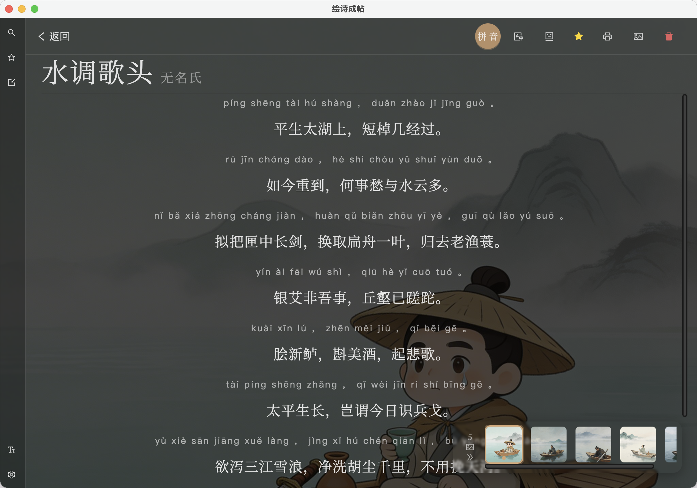
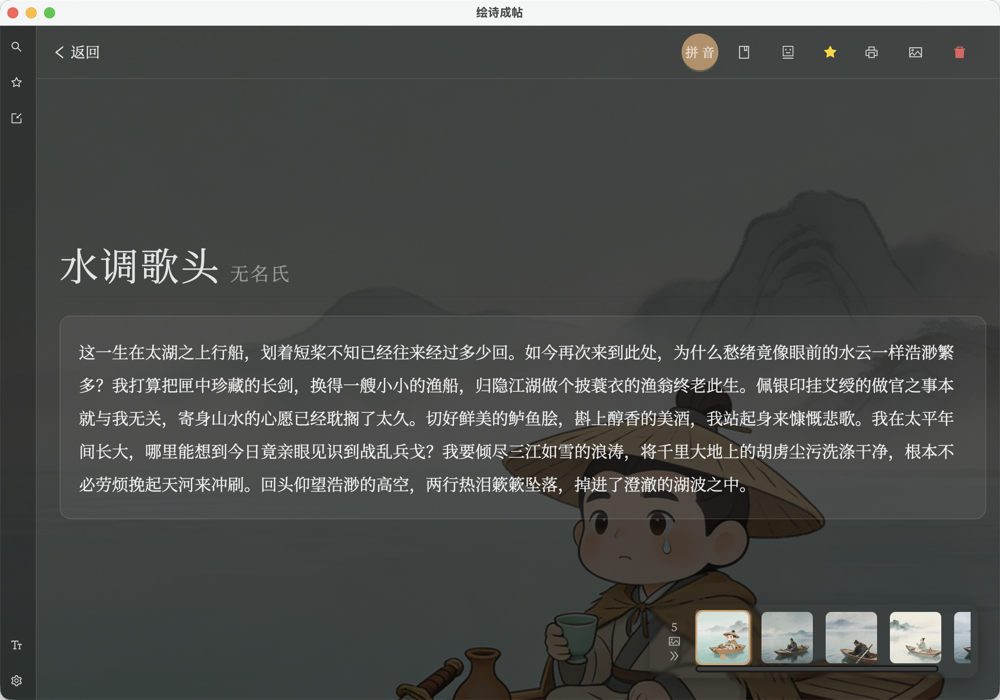
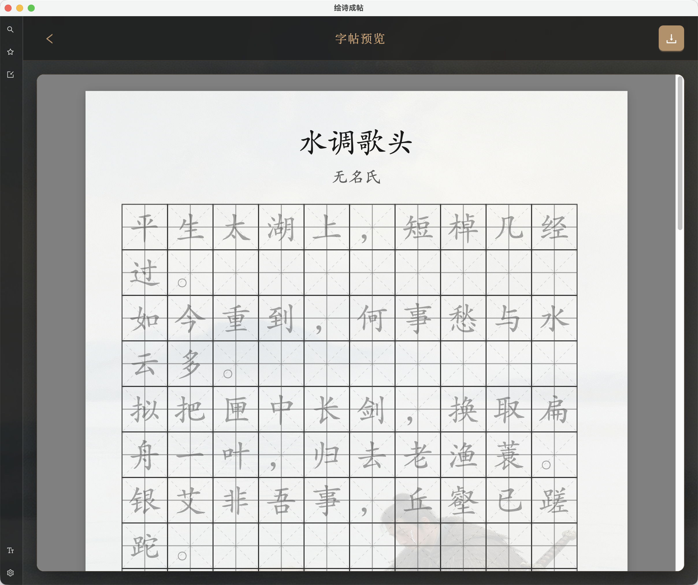
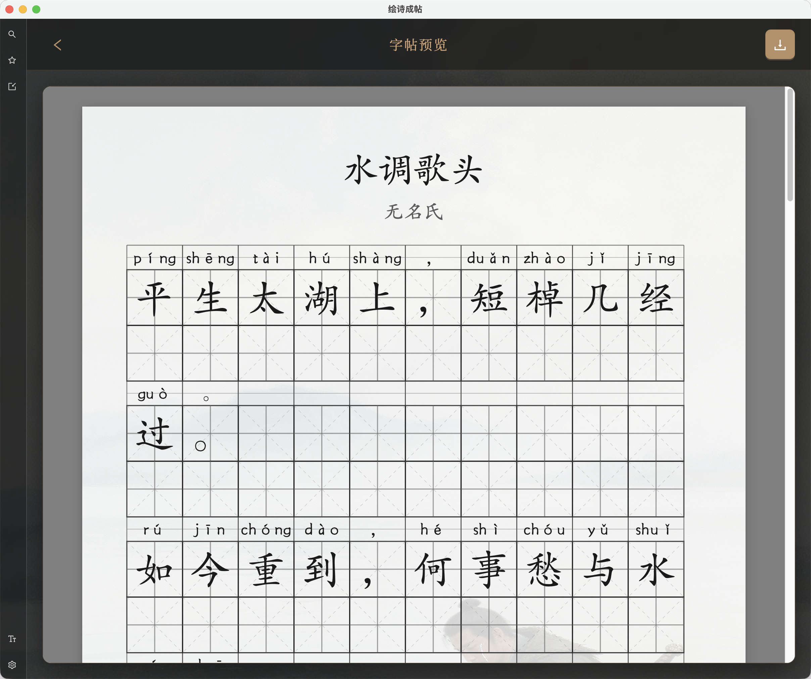
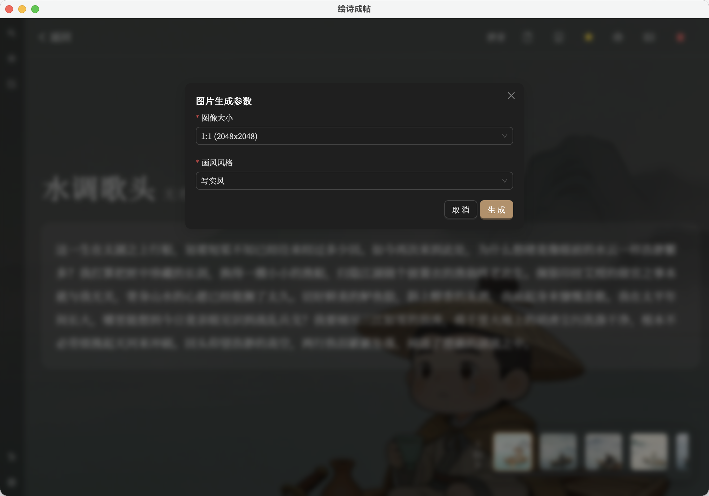

# PaintPoem / 绘诗成帖

<p align="center">
  
</p>

<p align="center">
  <b>将诗词转化为精美字帖的桌面应用</b>
</p>

<p align="center">
  <a href="https://github.com/xiaoxing/paint-poem/releases">
    
  </a>
  <a href="LICENSE">
    
  </a>
</p>

## 功能特性

- **诗词浏览** - 收录数千首古典诗词，支持搜索和分类浏览
- **字帖生成** - 一键生成临摹/练习字帖 PDF，支持米字格、田字格、回宫格
- **拼音支持** - 自动为诗词标注拼音，可选择是否打印
- **AI 配图** - 集成 AI 绘画，为诗词生成意境配图
- **字体管理** - 支持自定义字体，内置思源宋体
- **收藏功能** - 收藏喜爱的诗词，建立个人诗单
- **数据导入** - 支持从 GitHub 数据源批量导入诗词

## 应用截图

### 首页与搜索
<p align="center">
  
</p>

### 诗词详情
<p align="center">
  
  
</p>

### 字帖生成
<p align="center">
  
  
</p>

### AI 智能配图
<p align="center">
  
</p>

### 字体管理
<p align="center">
  
</p>

### 收藏管理
<p align="center">
  
</p>

### 数据导入
<p align="center">
  
</p>

## 技术栈

- **前端**: React 19 + TypeScript + Ant Design 6
- **桌面框架**: Tauri 2 (Rust)
- **状态管理**: Redux Toolkit
- **PDF 生成**: PDFKit
- **数据库**: SQLite (Tauri Plugin)
- **构建工具**: Vite

## 安装

### 下载预编译版本

前往 [Releases](https://github.com/xiaoxing/paint-poem/releases) 页面下载对应平台的安装包。

### 从源码构建

**环境要求:**
- Node.js 18+
- Rust 1.70+
- pnpm

**构建步骤:**

```bash
# 克隆仓库
git clone https://github.com/xiaoxing/paint-poem.git
cd paint-poem

# 安装依赖
pnpm install

# 开发模式
pnpm dev

# 构建生产版本
pnpm build
```

## 使用指南

### 基础使用

1. **浏览诗词** - 首页浏览诗词列表，点击进入详情
2. **生成字帖** - 在诗词详情页点击"打印字帖"按钮
3. **选择模式** - 选择"临摹模式"(灰色字)或"练习模式"(空格)
4. **下载 PDF** - 预览确认后下载 PDF 文件

### 字体设置

1. 进入"字体管理"页面
2. 上传自定义字体文件(TTF/OTF)
3. 设置全局默认字体或打印专用字体

### 数据导入

1. 进入"导入数据"页面
2. 选择需要导入的数据源
3. 点击"批量导入所有未导入数据源"

## 项目结构

```
paint-poem/
├── src/                    # 前端源码
│   ├── components/         # React 组件
│   ├── pages/              # 页面组件
│   ├── services/           # 业务逻辑服务
│   ├── store/              # Redux 状态管理
│   ├── db/                 # 数据库操作
│   ├── datas/              # 数据源配置
│   └── types/              # TypeScript 类型定义
├── src-tauri/              # Tauri 后端
│   ├── src/                # Rust 源码
│   ├── icons/              # 应用图标
│   └── Cargo.toml          # Rust 依赖配置
├── public/                 # 静态资源
└── docs/                   # 文档
```

## 数据源

本项目诗词数据来源于以下开源项目：

- [chinese-poetry](https://github.com/chinese-poetry/chinese-poetry) - 中华古诗词数据库

## 许可证

[MIT](LICENSE)

## 致谢

- [Tauri](https://tauri.app/) - 跨平台桌面应用框架
- [Ant Design](https://ant.design/) - UI 组件库
- [PDFKit](http://pdfkit.org/) - PDF 生成库
